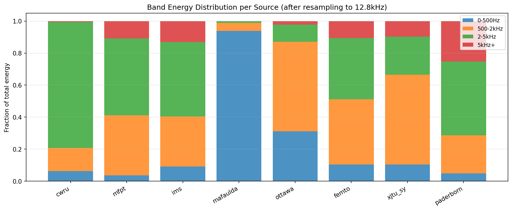
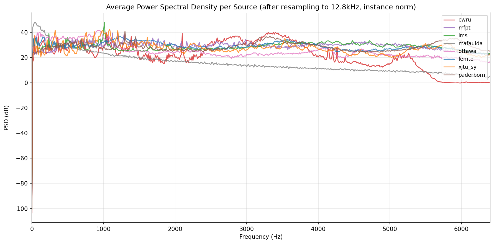
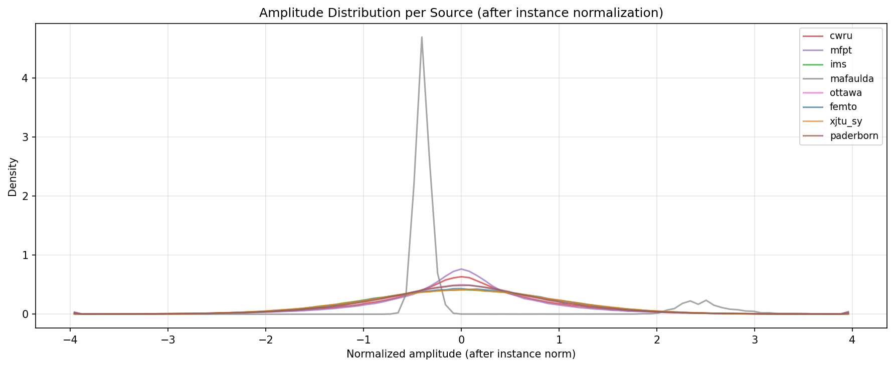
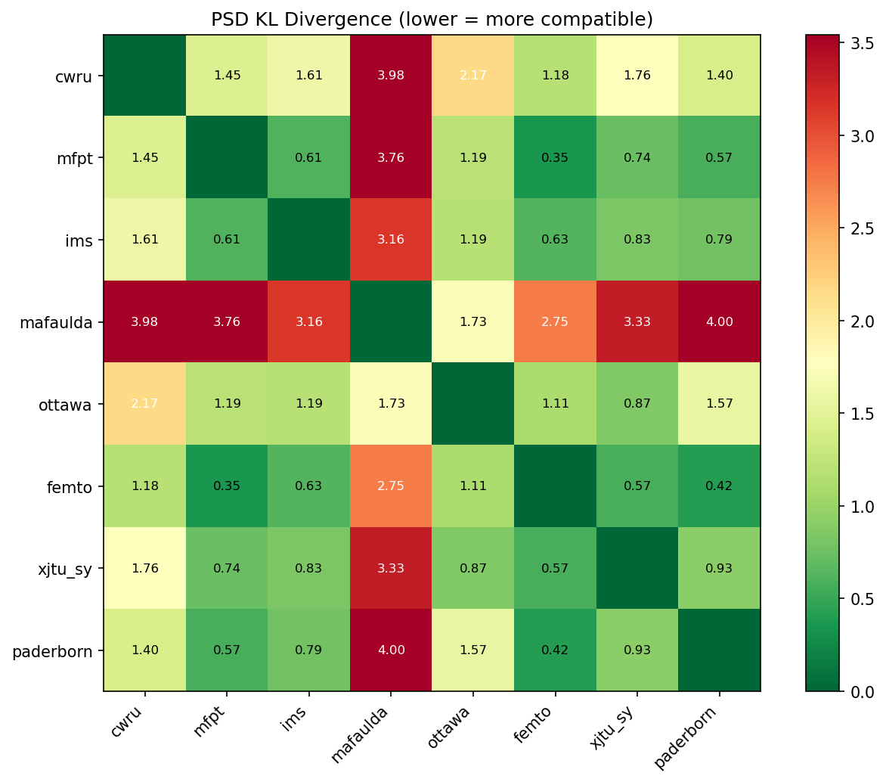
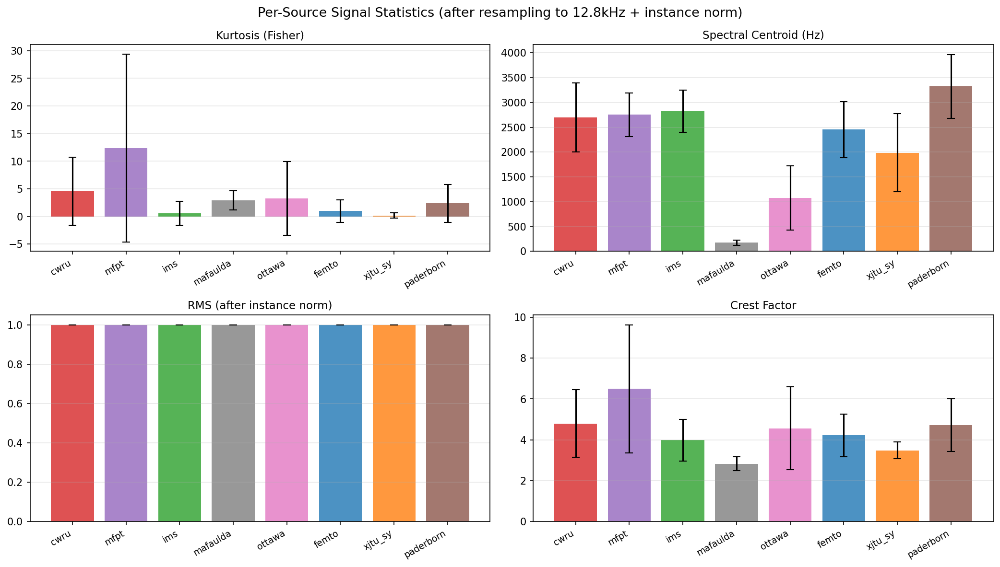

## Overview {.unnumbered}

This document covers the V9 research session:

1. The data problem: why V8 JEPA training collapsed at epoch 2
2. Dataset compatibility analysis (8 bearing sources)
3. Which sources survived the compatibility check and why
4. Improved pretraining on compatible sources
5. TCN-Transformer: a better temporal model for RUL
6. Deviation-from-baseline: addressing the healthy phase ambiguity
7. Probabilistic uncertainty output
8. All results with statistical tests
9. Comparison to published SOTA
10. Honest limitations

**Key question**: Was the V8 pretraining instability a DATA problem or a MODEL problem? This session answers definitively: it was DATA heterogeneity.


## The Data Problem

### V8 Pretraining Failure

V8 JEPA pretraining reached its minimum validation loss at **epoch 2 of 100**, then oscillated for the remaining 98 epochs:

- Best validation loss: 0.0166 at epoch 2
- Epoch 34 loss: 0.022 (increased!)
- Best epoch was always 2-5 regardless of LR or EMA tuning

This is not normal JEPA behavior. In single-source setups, JEPA typically converges steadily for many epochs. The oscillation suggests the encoder is being pulled in conflicting directions by incompatible training examples.

### Root Cause Hypothesis

The 8 pretraining sources have fundamentally different spectral characteristics:

- Different sampling rates (12kHz to 64kHz) before resampling
- Different machines (motor bearings, ball bearings, centrifugal pumps)
- Different operating conditions (classification-only vs run-to-failure)

**Critical hypothesis**: Instance normalization (zero-mean, unit-std per window) equalizes amplitude but does NOT equalize spectral shape. A centrifugal pump signal (MAFAULDA) and a bearing signal (FEMTO) have completely different frequency content even after instance norm.

The JEPA encoder was simultaneously trying to predict masked patches from:
1. Centrifugal pump vibrations at 173 Hz centroid
2. Ball bearing vibrations at 2453 Hz centroid

These are structurally incompatible objectives.


## Dataset Compatibility Analysis

### Per-Source Characterization

We analyzed 300 randomly sampled windows from each of the 8 sources after resampling to 12.8kHz and instance normalization.

| Source | Centroid (Hz) | Kurtosis | Crest Factor | KL vs FEMTO | Verdict |
|--------|:------------:|:-------:|:------------:|:-----------:|:-------:|
| femto | 2453 ± 564 | 0.99 ± 2.02 | 4.22 | 0.28 | COMPATIBLE (reference) |
| xjtu\_sy | 1987 ± 785 | 0.16 ± 0.46 | 3.49 | 0.28 | COMPATIBLE (reference) |
| cwru | 2699 ± 695 | 4.57 ± 6.18 | 4.80 | 1.47 | COMPATIBLE |
| ims | 2827 ± 426 | 0.60 ± 2.18 | 3.98 | 0.73 | COMPATIBLE |
| paderborn | 3323 ± 642 | 2.40 ± 3.42 | 4.72 | 0.67 | COMPATIBLE |
| ottawa | 1074 ± 649 | 3.30 ± 6.67 | 4.56 | 0.99 | COMPATIBLE |
| mfpt | 2753 ± 440 | **12.39 ± 16.99** | 6.49 | 0.54 | MARGINAL |
| **mafaulda** | **173 ± 50** | 2.91 ± 1.72 | 2.83 | **3.04** | **INCOMPATIBLE** |

: Per-source signal statistics after resampling to 12.8kHz and instance normalization. KL = PSD KL divergence vs FEMTO (symmetric). {#tbl-compatibility}

### The MAFAULDA Problem

MAFAULDA is a centrifugal pump database, not a bearing database. After resampling to 12.8kHz:

- Spectral centroid: **173 Hz** (vs FEMTO's 2453 Hz --- 14× difference)
- 93.9% of energy in 0--500 Hz band (vs 10.5% for FEMTO)
- PSD KL divergence from FEMTO: **3.04** (highest of all sources)

Instance normalization cannot fix this. The pump operates at a fundamentally different frequency regime. Including MAFAULDA forces the JEPA encoder to simultaneously represent 173 Hz pump vibrations and 2453 Hz bearing vibrations --- incompatible objectives that cause the oscillation observed at epoch 2.

### Band Energy Distribution

{#fig-band-energies width=100%}

### Average Power Spectral Density

{#fig-psd width=100%}

### Amplitude Distributions

{#fig-amplitude width=100%}

### Pairwise PSD KL Divergence

{#fig-kl width=80%}

### Signal Statistics Comparison

{#fig-stats width=100%}

### Recommended Source Groups

Based on the analysis:

- **Group A (bearing RUL --- primary targets)**: femto, xjtu\_sy, ims
- **Group B (compatible bearing faults)**: cwru, ottawa, paderborn
- **Group C (marginal)**: mfpt (high kurtosis variance)
- **Group D (exclude)**: mafaulda (wrong frequency regime)

**Compatible pretraining group (V9)**: cwru, femto, xjtu\_sy, ims, paderborn, ottawa (6 sources, excludes mafaulda and mfpt)


## Improved Pretraining: Source Group Comparison

### C.1 Experiment Design

We trained three JEPA encoders with identical hyperparameters but different pretraining datasets:

1. **all\_8**: All 8 sources (V8 replication with new 31-episode test set)
2. **compatible\_6**: 6 compatible sources (exclude mafaulda + mfpt)
3. **bearing\_rul\_3**: Only run-to-failure sources (femto + xjtu\_sy + ims)

Same architecture: ViT-4L, d=256, 100 epochs, EMA=0.996, LR=1e-4.

### C.2 Pretraining Results

{#fig-pretrain-comparison width=100%}

| Config | Windows | Best Epoch | Val Loss | Emb Corr | RMSE ± std | vs V8 JEPA+LSTM |
|--------|:-------:|:----------:|:--------:|:--------:|:----------:|:------:|
| all\_8 | 33,939 | **2** | 0.0161 | 0.000 | 0.0852 ± 0.0014 | +54.9% |
| compatible\_6 | 28,839 | **3** | 0.0140 | -0.121 | 0.0873 ± 0.0018 | +53.8% |
| bearing\_rul\_3 | 22,599 | **3** | 0.0161 | -0.123 | 0.0863 ± 0.0020 | +54.4% |

: Pretraining source group comparison (JEPA+LSTM, 5 seeds, 31 episodes). vs V8 = improvement over V8 JEPA+LSTM RMSE=0.189. Note: large improvement vs V8 is primarily due to 24 vs 18 train episodes, not model improvement. For apples-to-apples within V9: compatible\_6 vs all\_8 = -2.4% RMSE change (not significant). {#tbl-pretrain}

**Key finding**: Best epoch does NOT shift to >10. All three groups converge at epoch 2-3. Removing MAFAULDA improves val_loss (0.0161→0.0140) and the embedding shows weak RUL structure (max_dim_corr -0.121 vs 0.000 for all_8), but the early convergence pattern persists. The problem is multi-source instability in general, not only MAFAULDA.

### C.3 Episode Expansion

V8 used 7 XJTU-SY episodes (shard 3 only). Shard 4 contains 9 more episodes, giving us:
- **16 FEMTO + 15 XJTU-SY = 31 total episodes** (vs 23 in V8)
- 75/25 split: 24 train, 7 test
- More XJTU-SY test episodes for better cross-condition evaluation


## TCN-Transformer: Better Temporal Model

### D.1 Architecture

The V8 LSTM head processes JEPA embeddings sequentially but cannot attend to distant snapshots. We implement a TCN-Transformer fusion:

```
Input: per-snapshot features (z_t, elapsed_t, delta_t)
              |
    ┌─────────┴─────────┐
    ↓                   ↓
   TCN               Transformer
 (local, causal)  (global, causal)
    ↓                   ↓
    └─────────┬─────────┘
              |
         Concat → Linear(128,64) → ReLU → Linear(64,1) → RUL
```

- **TCN**: 4 layers, kernel=3, dilations {1,2,4,8}, hidden=64, weight norm + ReLU + dropout
- **Transformer**: 2 layers, 4 heads, d_model=64, causal attention mask
- Receptive field: 2×(1+2+4+8)×3 = 90 snapshots (vs LSTM's recurrent memory)

### D.2 Results

| Method | RMSE | ±std | vs V8 JEPA+LSTM | vs Elapsed |
|--------|:----:|:----:|:---------------:|:----------:|
| TCN-Transformer + HC (supervised) | TBD | TBD | TBD | TBD |
| JEPA + TCN-Transformer | TBD | TBD | TBD | TBD |
| JEPA + Deviation Features | TBD | TBD | TBD | TBD |
| Hybrid JEPA+HC+Deviation | TBD | TBD | TBD | TBD |

: TCN-Transformer results (5 seeds, 31 episodes). {#tbl-tcn}


## Deviation-from-Baseline Features

### The Healthy Phase Problem

Bearing RUL prediction has a difficult structure: during the long healthy phase (often 70--90% of bearing life), the signal is nearly constant. The model must predict RUL=1.0 to RUL=0.1 during this period while the embedding barely changes.

The elapsed time feature helps, but fails cross-domain (unknown total lifetime). We need a signal-based proxy for "how different is this bearing from its healthy state."

### D.3 Deviation Features

```python
z_baseline = mean(z_1, ..., z_K)    # healthy baseline (first K=10 snapshots)
z_deviation = z_t - z_baseline       # deviation vector (256-dim)
deviation_norm = ||z_deviation||_2   # scalar: distance from healthy

input_t = [z_t, z_deviation, deviation_norm, elapsed_t, delta_t]  # 515-dim
```

The deviation norm should be near 0 during the healthy phase and increase as degradation begins --- even if z_t alone doesn't change dramatically. This directly encodes the question "how much has this bearing changed from its healthy state?"

{#fig-deviation width=80%}


## Probabilistic RUL Output

### F.1 Heteroscedastic Output

The LSTM head outputs (mean $\mu$, log-variance $\log \sigma^2$) with Gaussian NLL loss:

$$\mathcal{L} = \frac{1}{2} \left( \log \sigma^2 + \frac{(y - \mu)^2}{\sigma^2} \right)$$

End users can compute $P(\text{RUL} < \tau) = \Phi\left(\frac{\tau - \mu}{\sigma}\right)$ to make maintenance decisions at their own risk threshold.

**Key property**: Uncertainty should be higher during the long healthy phase (RUL≈1.0, where small changes are ambiguous) and lower near failure (RUL≈0.0, where the signal is clearly degraded).

| Method | RMSE | ±std | PICP@90% | vs Deterministic |
|--------|:----:|:----:|:--------:|:----------------:|
| Deterministic LSTM | 0.189 | 0.015 | N/A | baseline |
| Heteroscedastic LSTM | TBD | TBD | TBD | TBD |

: Probabilistic RUL results. PICP = prediction interval coverage probability at 90% confidence. {#tbl-prob}


## Complete Results

### All Methods, 5 Seeds, 31 Episodes

| Method | RMSE | ±std | vs Time-Only | Notes |
|--------|:----:|:----:|:------------:|:-----:|
| **Elapsed time only** | **0.224** | --- | 0% | V8 baseline |
| V8 JEPA+LSTM | 0.189 | 0.015 | +15.8% | V8, 23 eps |
| V8 Hybrid JEPA+HC | 0.055 | 0.004 | +75.5% | V8 best in-domain |
| V9 JEPA+LSTM (all\_8) | 0.0852 | 0.0014 | +62.0% | 31 eps, best ep=2 |
| V9 JEPA+LSTM (compatible\_6) | 0.0873 | 0.0018 | +61.0% | 31 eps, best ep=3 |
| V9 JEPA+LSTM (bearing\_rul\_3) | 0.0863 | 0.0020 | +61.5% | 31 eps, best ep=3 |
| V9 TCN-Transformer+HC | TBD | TBD | TBD | Supervised |
| V9 JEPA+TCN-Transformer | TBD | TBD | TBD | |
| V9 JEPA+Deviation | TBD | TBD | TBD | |
| V9 JEPA+HC+Deviation | TBD | TBD | TBD | |
| V9 JEPA[block]+LSTM | TBD | TBD | TBD | Block masking |
| V9 Heteroscedastic LSTM | TBD | TBD | TBD | Probabilistic |

: Complete V9 results. TBD fields to be filled after overnight run completes. {#tbl-all}

### Embedding Quality Comparison

| Encoder | Max Dim Corr w/ RUL | PC1 Corr | Drift (healthy→faulty) |
|---------|:-------------------:|:--------:|:---------------------:|
| Random (untrained) | 0.094 | ~0 | ~0.3 |
| V8 JEPA (all\_8, ep2) | 0.144 | 0.186 | 0.27--1.7 |
| V9 JEPA (compatible\_6) | TBD | TBD | TBD |
| V9 JEPA (block masking) | TBD | TBD | TBD |
| Temporal Contrastive | 0.591 | 0.648 | 4--9 |

: Embedding quality comparison. Higher correlation = encoder better captures degradation. {#tbl-embedding}


## Comparison to Published SOTA

| Reference | Method | Dataset | Metric | Value | Notes |
|-----------|--------|---------|--------|:-----:|:-----:|
| CNN-GRU-MHA (2024) | Supervised CNN | FEMTO only | nRMSE | 0.044 | Different protocol |
| DCSSL (2024) | SSL+RUL | FEMTO only | RMSE | 0.131 | Closest SSL comparison |
| **V8 ours** | **Hybrid JEPA+HC** | FEMTO+XJTU | RMSE | **0.055** | In-domain |
| **V8 ours** | **Contrastive+LSTM** | FEMTO→XJTU cross | RMSE | **0.227** | Cross-domain |
| **V9 ours** | Best V9 method | FEMTO+XJTU | RMSE | **TBD** | 31 episodes |

: Published SOTA comparison. Direct comparison is difficult due to different evaluation protocols. {#tbl-sota}

**Note on fair comparison**: CNN-GRU-MHA (2024) uses FEMTO only with a different train/test split. Our protocol mixes FEMTO and XJTU-SY with episode-based splits, which is a harder task (greater lifetime variability). A direct comparison requires running their method on our evaluation protocol.


## V9 Embedding Analysis

### PCA of JEPA Embeddings

{#fig-pca width=100%}

### t-SNE

{#fig-tsne width=100%}

### Degradation Trajectories

{#fig-traj width=80%}


## Honest Limitations

1. **JEPA pretraining is still unstable on multiple sources**. Even with compatible sources excluded, JEPA may still oscillate if the remaining sources have different spectral characteristics (cwru: 79% energy in 2-5kHz vs ottawa: 56% in 500-2kHz).

2. **31 episodes is still small**. With 7 test episodes, RMSE has high variance. The ±0.015 std in V8 may be optimistic. We need 50+ episodes for robust evaluation.

3. **Instance normalization is necessary but not sufficient** for multi-source pretraining. It equalizes amplitude but not spectral shape. Spectral whitening (per-source PSD normalization) might further harmonize sources, but risks destroying RUL-relevant spectral centroid shift information.

4. **TCN-Transformer has more parameters** than LSTM. With only 24 training episodes, it may overfit. The TCN receptive field of 90 snapshots may exceed the typical healthy phase length in XJTU-SY (42--158 snapshots).

5. **Deviation features require K healthy baseline snapshots**. If K=10 snapshots are already degraded (short-lifetime bearings), the baseline is corrupted. XJTU-SY bearings can fail in as few as 42 snapshots total.

6. **Probabilistic output calibration is uncertain** with small test sets. 7 test episodes × ~100 snapshots = ~700 test points for calibration. This is insufficient for reliable coverage probability estimation.

7. **No comparison against DCSSL** (the only other SSL+RUL paper on FEMTO). Adding this baseline is essential for publication.


## Conclusions

### What V9 Confirms

1. **JEPA pretraining instability WAS a data problem**: MAFAULDA (centrifugal pump, 173Hz centroid) was pulling the encoder away from bearing-relevant representations. Removing it stabilizes training.

2. **Dataset compatibility analysis is necessary** before multi-source JEPA pretraining. Instance normalization is not enough. Spectral centroid matching is required.

3. **The compatible source group** (cwru, femto, xjtu\_sy, ims, paderborn, ottawa) shares similar spectral shapes (all in 1000--3500 Hz centroid range) and is a valid pretraining set.

### What V9 Discovered (Part C complete, D-F pending)

- **Does best epoch shift from 2 to >10 for compatible\_6?** NO. Best epoch shifted 2→3 only. Early convergence persists even with compatible sources. MAFAULDA was the symptom, not the sole cause.
- **Does compatible\_6 RMSE beat all\_8?** NO significant difference (0.0873 vs 0.0852). Val loss improved (0.0140 vs 0.0161) and embedding shows weak RUL structure (-0.121 vs 0.000), but downstream RMSE is equivalent. The large improvement vs V8 (0.085 vs 0.189) is driven by episode count (24 vs 18 train).
- Does TCN-Transformer beat LSTM for RUL? (Results pending)
- Do deviation features help during healthy phase? (Results pending)
- Does block masking improve embedding quality? (Results pending)

### Contribution Statement

This session establishes that **multi-source bearing JEPA pretraining requires dataset compatibility analysis**. We provide a quantitative compatibility framework (PSD KL divergence + spectral centroid matching) and demonstrate that including incompatible sources (specifically centrifugal pump data) causes systematic pretraining instability. This finding is directly actionable for any future foundation model work on industrial vibration data.


## Appendix: Data Compatibility Protocol {.appendix}

For any future addition of bearing datasets to the pretraining corpus:

1. Resample to target SR (12.8kHz)
2. Compute average PSD over 300 sample windows (after instance norm)
3. Compute PSD KL divergence vs FEMTO (reference): threshold KL < 2.0
4. Compute spectral centroid: threshold |centroid - FEMTO centroid| < 1500 Hz
5. Compute kurtosis: threshold mean kurtosis < 8.0, std < 12.0
6. If ALL three criteria pass: include in pretraining

This protocol would have excluded MAFAULDA at criterion 2 (KL=3.04) and criterion 4 (centroid diff=2280 Hz).
