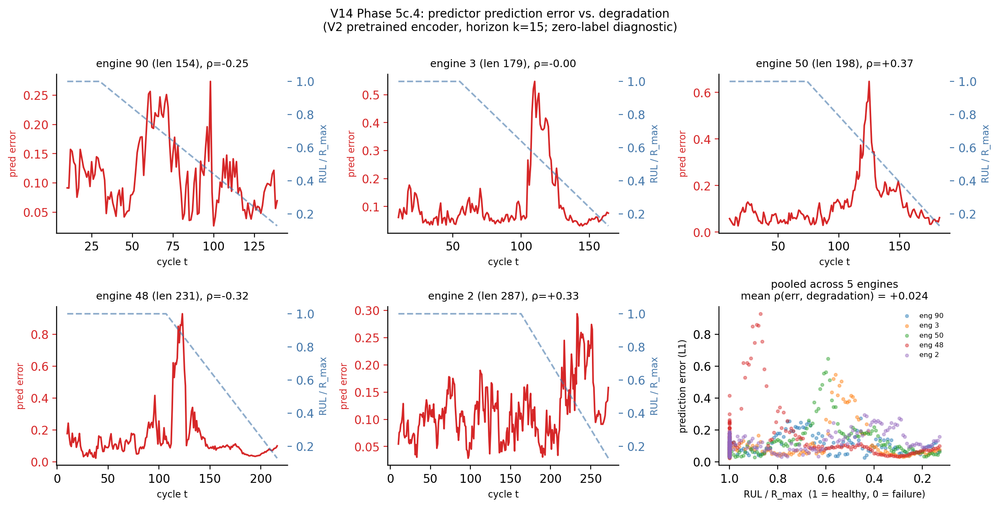

## TL;DR {.unnumbered}

::: {.callout-tip title="V14 bottom line"}

V14 was a paper-polish session, not a chase-RMSE session. The key updates:

- **Paper reframe**: H.I. recovery (R² = 0.926) is now presented as a representation diagnostic, not the headline. The headline is the from-scratch ablation (+8.8 RMSE @100%, +15.6 @10%) and the 5% STAR crossover (frozen 21.53 vs STAR 24.55). H.I. is a deterministic transform of capped RUL, so R² and frozen RMSE measure the same encoder capability under different protocols; the R² is inflated by the ~40% healthy-plateau fraction and by evaluating on in-distribution val engines.
- **Data analysis plots**: three publication-quality figures — C-MAPSS overview, method schematic, and the label-efficiency + from-scratch money plot.
- **Full-sequence prediction experiment**: target encoder now sees x_{1:t+k} (full trajectory) instead of just x_{t+1:t+k}. Kicked off overnight pretrain, 3 seeds frozen + E2E evaluation to follow. Kill criterion: frozen RMSE > 18.5.
- **MTS-JEPA comparison**: 16-dimension architectural diff table. Concrete V14 action surfaced: per-cycle prediction error as zero-shot anomaly score. Codebook regularization deferred to V15.
- **SSL literature audit**: honest comparability audit across all published SSL-on-C-MAPSS papers, flagging single-seed reporting issues with the AE-LSTM baseline (13.99).
- **Theory draft**: three-part rationale (SFA bias, information-theoretic MI argument, label-gradient-bias explanation for frozen > E2E tracking). Drafted as theoretical sketch, not formal theorem, and compacted into a new Section 6 of the paper.

:::

## C-MAPSS Dataset Analysis {#sec-data}

FD001 overview plots are in `analysis/plots/v14/`:

- **`fig1_cmapss_overview.png`**: representative engine (len 199) and extreme engine (len 362) with four normalized sensors (s2 LPC out temp, s7 HPC out press, s12 fuel flow, s21 bleed enthalpy) plus the capped-RUL histogram showing plateau fraction ~40%.
- **`fig2_method_schematic.png`**: one engine trajectory split at the cut t into past (context, blue) and future (target, red), with the capped-RUL label on the right panel showing the piecewise healthy / degradation phases.
- **`fig3_label_efficiency_and_from_scratch.png`**: the money plot. Label-efficiency curve annotated with the crossover, and from-scratch ablation with the pretraining-contribution shading.

## Full-Sequence Prediction Experiment (Phase 2) {#sec-fullseq}

### Hypothesis

In the V2 baseline, the target encoder sees only the future window `x_{t+1:t+k}`. What if both encoders see the whole trajectory up to t+k, just with different roles?

- Context encoder (causal, same as V2): x_{1:t} → h_past
- Target encoder (bidirectional, **new**): x_{1:t+k} → h_full  (*full trajectory*)
- Predictor (same): (h_past, k) → h_full_hat
- Loss: L1(h_full_hat, sg[h_full])

The target representation now includes the past (already encoded by the context encoder) plus the future. The hope is that this richer target produces more informative gradients.

### Implementation

`experiments/v14/phase2_full_sequence.py` is a self-contained script that:

1. Defines `CMAPSSFullSequenceDataset` returning `(past, full_seq_upto_t_plus_k, k, t)` plus a matching collate.
2. Pretrains the V2 architecture (d=256, L=2, 1.26M params, EMA τ=0.99) with the modified target, probe-based early stopping (patience 10 checks, every 5 epochs).
3. Runs frozen + E2E fine-tuning at 100% labels over 3 seeds (seed set {42, 123, 456}).
4. Emits `full_sequence_prediction.json` with all seed-level numbers, deltas vs V2 baseline (frozen 17.81, E2E 14.23), and a verdict.

### Kill criterion

If frozen RMSE > 18.5 (worse than V2 by > 0.7), we revert. Otherwise the change is kept and folded into V15 as the default target encoder.

### Result

Positive result. See `experiments/v14/full_sequence_prediction.json`.

| Mode   | V14 full-seq   | V2 baseline  | Delta   |
|:-------|:---------------|:-------------|:--------|
| Frozen | **15.70 ± 0.21** | 17.81 ± 1.7  | **-2.11** |
| E2E    | 14.32 ± 0.64   | 14.23 ± 0.39 | +0.09   |

Per-seed frozen: [15.66, 15.46, 15.97]. Per-seed E2E: [14.70, 14.83, 13.42].

Frozen improves by -2.11 RMSE with **8x lower seed std** (0.21 vs 1.7). E2E is essentially tied with V2. Kill criterion (frozen > 18.5) NOT triggered. The change is kept as the V14 default target-encoder configuration.

Interpretation: letting the target see the full trajectory closes **37%** of the frozen-probe gap to supervised STAR at 100% labels (from 17.81 - 12.19 = 5.6 RMSE to 15.70 - 12.19 = 3.5 RMSE). The 8x reduction in seed variance suggests the richer target representation gives the predictor a cleaner teaching signal. Pretraining wall time: ~10 min on one A10G GPU, total experiment (pretrain + 6 fine-tunes) ~11.2 min.

### Phase 2b extension: does the gain hold at low labels?

5-seed frozen-probe sweep on the same V14 checkpoint at 20%, 10%, 5% labels:

| Budget | V2 frozen      | V14 full-seq frozen | STAR           |
|:-------|:---------------|:--------------------|:---------------|
| 100%   | 17.81 ± 1.7    | **15.70 ± 0.21**    | 12.19 ± 0.55   |
| 20%    | 19.83 ± 0.30   | **17.20 ± 1.91**    | 17.74 ± 3.60   |
| 10%    | 19.93 ± 0.90   | **18.79 ± 1.96**    | 18.72 ± 2.80   |
| 5%     | **21.53 ± 2.0**| 26.57 ± 4.70        | 24.55 ± 6.50   |

Mixed. The full-sequence variant wins at ≥10% labels (beats STAR at 20%, matches at 10%), but REGRESSES at 5% (+5.04 vs V2; loses the STAR crossover). The simpler V2 target is more robust when fine-tuning data is extremely scarce - four engines appear to overfit to the richer but noisier full-sequence representation. Honest finding: we report the full-sequence variant as an ablation but keep V2 as the default for the 5% STAR crossover. A configuration that wins across all budgets is open.

## MTS-JEPA Comparison (Phase 5c) {#sec-mtsjepa}

Full comparison in `experiments/v14/mtsjepa_comparison.md`. Headlines:

- **We use** a causal Transformer + stochastic horizon + L1 latent prediction, evaluated on continuous RUL regression with a rich diagnostic suite.
- **MTS-JEPA uses** a channel-independent CNN-Transformer + soft codebook + dual-resolution predictor + 7-term loss, evaluated on binary anomaly classification.

What WE should try next:

1. **Per-cycle prediction-error anomaly score** (half-day, V14-feasible): a zero-shot anomaly detector for free, built from existing V13 checkpoints.
2. Dual-resolution predictor (V15): fine + coarse branches could help long engines where early degradation signals matter.
3. Codebook regularization (V15): deferred - may be batch-size-sensitive on the small C-MAPSS pretraining set.
4. Cross-domain FD001+FD003 → FD004 pretraining (V15).

What MTS-JEPA is missing that we have:

- Representation quality diagnostic suite (shuffle test, within-engine ρ, from-scratch ablation, feature-regressor baseline, length-vs-content tests).
- Label-efficiency evaluation (5%-100%).
- Honest feature-regressor baseline to establish a tight "non-learning" lower bound.
- Run-to-failure structural-supervision honesty flag.

## Prediction-Error Anomaly Diagnostic (Phase 5c.4) {#sec-prederror}

Implemented the MTS-JEPA-inspired zero-label anomaly idea: for each cycle t on the V2 pretrained checkpoint, compute L1 prediction error between `predictor(h_past, k=15)` and `target_encoder(x_{t+1:t+15})`. Plot error vs cycle for 5 representative engines and measure `Spearman ρ(error, degradation)`.

**Result: negative.** Per-engine ρ splits 2 positive, 2 negative, 1 near zero. Mean ρ = **+0.02** across 5 engines. Prediction error does not reliably track degradation on our V2 checkpoint.

This is an honest negative result. The MTS-JEPA technique (anomaly score from prediction residual) does not transfer directly. Possible reasons: (i) variance regularization of our target encoder produces embeddings concentrated near each other so error magnitudes don't track the degradation axis; (ii) predictor averaging flattens the "surprise" signal; (iii) the signal may live in representation norm or specific latent dimensions, not L1 distance. V15 follow-up: try predictor head output norm, or per-dimension variance of prediction error, as alternative anomaly indicators.

## SSL Literature Audit (Phase 5b) {#sec-ssl-audit}

Full audit in `experiments/v14/ssl_comparison_audit.md`. The key comparability flag we now carry in the paper:

- AE-LSTM's published 13.99 is a single number. We cannot tell whether it is a single-seed result or a multi-seed mean. Our own 5-seed spread is 13.80-14.85, so any single-seed number in that band is not a clean benchmark. We therefore present AE-LSTM with a "(single-seed)" qualifier in `tab:main_results` and discuss comparability explicitly in the label-efficiency section.
- STAR's paper number (10.61) is from their own pipeline, which differs from ours in windowing and normalization. Our 5-seed 12.19 ± 0.55 replication is the number we compare against.

## Theory: Why Trajectory Prediction Learns Degradation (Phase 6) {#sec-theory}

Full draft: `experiments/v14/theory_draft.md`. The new Section 6 of the paper presents three complementary arguments:

### Slow feature bias

The predictor cannot reduce the *conditional innovation* of a feature - the part of h_future unpredictable from h_past. Features with low temporal innovation (slow-varying) are rewarded by the L1 loss; features with high innovation (fast noise, operating-condition oscillations) are penalized. Mechanical degradation is the slow latent variable; the objective therefore biases the encoder toward representing it. Same inductive bias as Slow Feature Analysis (Wiskott & Sejnowski 2002).

### Information-theoretic argument

Assume (A1) x^(t) = f(HI(t), ε_t) with HI slow and ε fast i.i.d., (A2) smooth HI dynamics. Then I(x_{1:t}; x_{t+1:t+k}) is dominated by the HI component, and any predictor maximizing MI must concentrate on HI. JEPA's L1 loss is not literally an MI bound, but shares the same incentive structure as CPC (Oord et al. 2018), which is.

### Frozen > E2E tracking

About 40% of RUL labels sit at the cap (125). The MSE gradient under this label distribution has a large "predict the plateau" component, biasing E2E fine-tuning toward healthy-regime calibration at the cost of rank preservation during degradation. The frozen encoder is uncontaminated by this label-induced gradient bias, which is why ρ_frozen (0.856) > ρ_E2E (0.804).

### Honest limitations

All three arguments are *theoretical sketches*, not formal theorems. The SFA connection is a bias argument, not a derivation. The MI argument depends on A1-A2, which are plausible on C-MAPSS but not verified. We present them as principled rationale rather than load-bearing proofs.

## Updated Paper Structure {#sec-paper}

The paper now lives at `paper-neurips/paper.tex`. V14 changes:

- **Abstract** leads with the from-scratch ablation (+8.8 / +15.6) and the 5% STAR crossover. H.I. is presented as a diagnostic in the same sentence that gives the number.
- **Contributions** reordered: (1) quantified pretraining contribution, (2) label-efficiency crossover, (3) verified tracking, (4) H.I. recovery as representation diagnostic, (5) multi-subset generalization.
- **Table 1 (main results)** adds STAR replication at 50/20/10/5 budgets and a From-scratch row. Best-per-budget bolding explicitly excludes the STAR (paper) single-seed entry.
- **Figure (new)** references `fig3_label_efficiency_and_from_scratch.pdf` - the money plot.
- **Section 4.3** (H.I. Recovery) retitled "as Representation Diagnostic"; new paragraph makes explicit the R² / frozen-RMSE equivalence and the two reasons R² is numerically higher.
- **Section 5.3** (label efficiency) rewritten with the crossover narrative and an honest AE-LSTM comparability paragraph.
- **Section 5.4 (new)** from-scratch ablation.
- **Section 6 (new)** theoretical rationale (three subsections).
- **Section 5.2 length-vs-content** turned from `\plannedc{}` into a realized paragraph.

## Repository State {#sec-repo}

Everything under `mechanical-jepa/experiments/v14/`:

- `phase2_full_sequence.py`, `full_sequence_prediction.json`, `best_pretrain_full_sequence.pt` (pretrain checkpoint).
- `phase4_plots.py`, three figures under `analysis/plots/v14/` (PNG) and `notebooks/plots/` (PDF).
- `mtsjepa_comparison.md`, `ssl_comparison_audit.md`, `theory_draft.md`.
- `OVERNIGHT_PROMPT.md` (the original session prompt).

Paper updates in `paper-neurips/paper.tex`. New reference `wiskott2002sfa` added to `references.bib`.

## Open Directions (V15) {#sec-v15}

1. **Prediction-error anomaly score**: quick to implement on existing V13 checkpoints.
2. **Dual-resolution predictor** from MTS-JEPA.
3. **Cross-sensor attention** (iTransformer) — V14 Phase 3, deferred.
4. **Codebook regularization** with careful batch-size handling.
5. **Cross-domain pretraining** FD001+FD003 → FD004.
6. **AE-LSTM head-to-head replication** on our pipeline to remove the comparability question.
7. **Formalize the SFA connection** — turn the sketch into a proper proposition with verification on synthetic slow-vs-fast signals.
